<p align="center">
  
</p>

<h1 align="center">Elaine</h1>

<p align="center">A local-first AI assistant with scheduling, memory, and agentic tool use — runs entirely on your machine.</p>

---

## Features

### Chat

Streaming responses with real-time markdown rendering, code highlighting, reasoning blocks, and inline interactive widgets. Attach a workspace path to any conversation for context-aware suggestions.

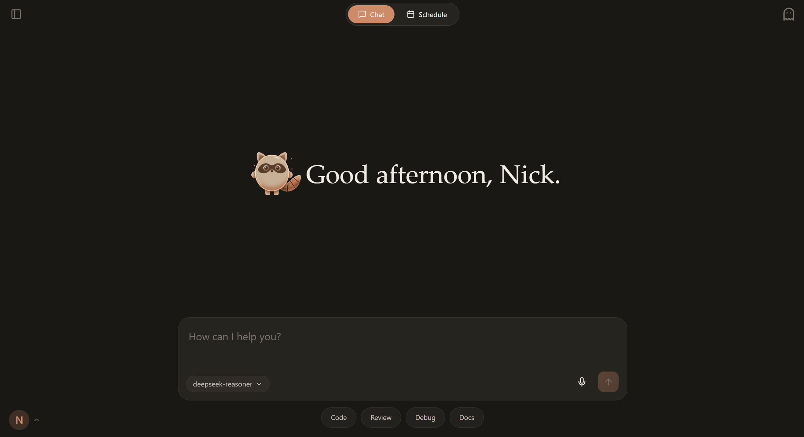

- Streaming responses via SSE with real-time rendering
- Markdown, code highlighting, reasoning blocks, and inline widgets
- Workspace-aware prompts — attach a project path to any conversation
- Background title generation (or manual titles, never overwritten)
- Image attachments in supported models

### Agent & Tool Use

The agent runs a multi-step loop — it can search the web, read and write files, run shell commands, query memory, and render visualizations inline, all within a single response.

<div style="display:grid;grid-template-columns:1fr 1fr;gap:12px">

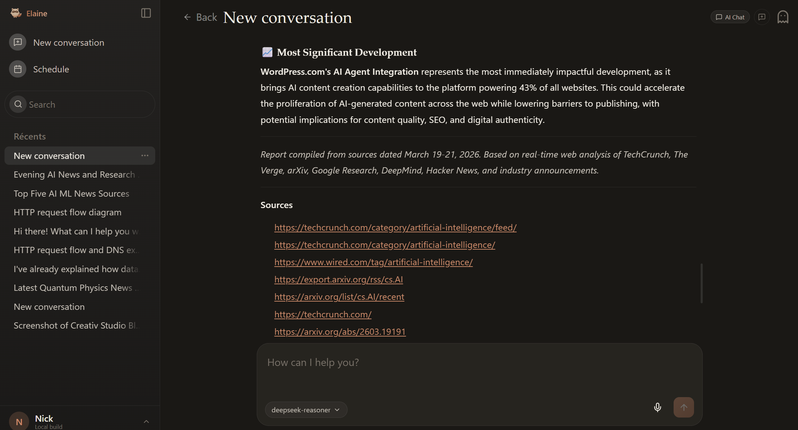

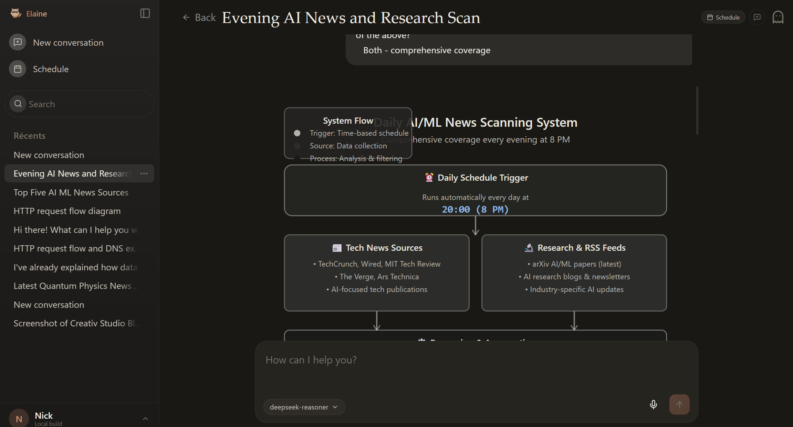

</div>

- Three agent modes with iteration caps:
  - **Chat** — 5 iterations, conversational
  - **Task** — 30 iterations, deep research and multi-step execution
  - **Scheduled** — 50 iterations, fully autonomous (no user present)
- Built-in skills available to the agent:
  - `ask_user` — request clarification mid-task
  - `think` — structured internal reasoning step
  - `task_done` — signal task completion
  - `file_read`, `file_write`, `file_search` — local filesystem access
  - `shell_exec` — run shell commands
  - `web_fetch` — fetch and parse web pages
  - `memory_search` — query the user's memory store
  - `notify_user` — surface a notification to the user
  - `send_message` — post a message to the conversation
  - `visualize__show_widget` — render interactive UI widgets inline
  - `schedule_setup` — create a scheduled task from a conversation
  - `schedule_task` — schedule a task programmatically

### Scheduling

Describe what you want done and when — Elaine sets up the schedule through natural conversation. Each run executes as a fully autonomous agent with access to all tools.

<div style="display:grid;grid-template-columns:1fr 1fr;gap:12px">

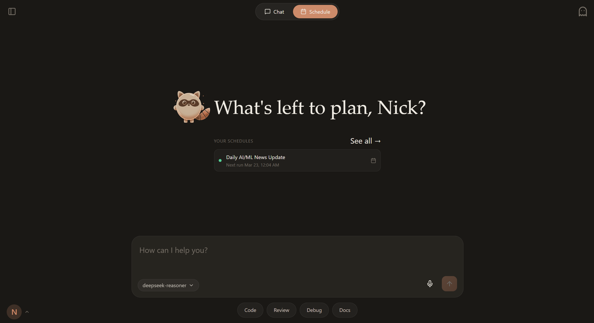

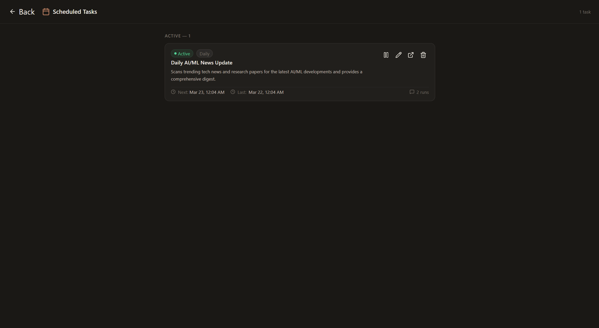

</div>

- Natural-language schedule creation via conversation (AI calls `schedule_setup`)
- Supports intervals: 5 min, 15 min, 30 min, 1 h, 4 h, 12 h, daily, weekly
- Time-of-day picker for daily schedules; weekday + time picker for weekly
- Optional run limit (`maxRuns`)
- Inline timing editor on the `/schedules` page
- Each run creates a new conversation tagged `scheduled_run`, titled `YYYY-MM-DD — <job title>`
- Full task-mode agent loop runs at each scheduled interval
- Schedule recap on the new chat screen when in schedule mode
- **Browser notifications** for schedule start and completion — clicking opens the run conversation

### Security & Permissions

Every agent skill that touches sensitive capabilities (network, filesystem, shell) requires an explicit grant before it can run. The permission model has three modes:

<div style="display:grid;grid-template-columns:1fr 1fr;gap:12px">

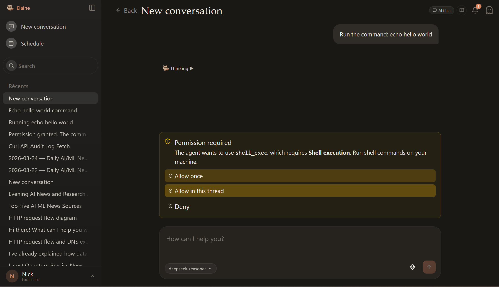

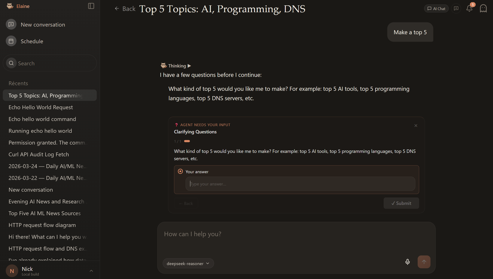

</div>

- **Allow once** — grants the capability for a single tool call; you are prompted again next time
- **Allow in this thread** — grants for the rest of the conversation; no further prompts in this session
- **Deny** — rejects the action; the agent receives the refusal and can adjust its plan
- Task mode now requires permission grants (same as chat mode — no capability is silently auto-granted)
- Intent classifier uses model substitution rules: `*-reasoner` models automatically route to `*-chat` for classification so reasoning-budget models do not silently fail
- Pending interactions (permission request, `ask_user` questions, schedule confirmation) survive page refresh and device changes — state is persisted in the database and rehydrated on load

### Notifications

Browser notifications (Web Notifications API) keep you informed without staying glued to the app. All notifications are persisted to the database and accessible via the dedicated `/notifications` page.

- **Permission required** — fires immediately if the page is hidden when the agent requests a capability grant
- **Agent needs input** — fires when an `ask_user` clarification widget arrives and the page is hidden
- **Schedule ready** — fires when a schedule confirmation widget is waiting for your approval
- **2-minute reminder** — if any of the above interactions remain unanswered and the page is hidden, a reminder fires after 2 minutes
- **Schedule started** — fires when a scheduled job begins its agent run
- **Schedule completed** — fires when the run finishes (success or failure); clicking opens the result conversation
- Notifications also fire when the page moves to the background while an interaction is pending
- Notifications are NOT re-fired on page refresh or navigation — only genuinely new interactions trigger them

The `/notifications` page provides a split-pane inbox: list on the left, detail on the right. Mark individual notifications read/unread, delete them, or open the linked conversation directly. The sidebar profile menu shows an unread badge.

The browser will ask for notification permission on first load. Notifications are only delivered when permission is granted.

### Connections

Connect external services so the agent can act on your behalf. OAuth credentials are stored encrypted on your device and never leave your machine.

- Supported providers: **GitHub**, **Google / Gmail**, **Discord**, **Slack**, **Twitter / X**, **LinkedIn**, **Telegram**
- OAuth 2.0 with PKCE (Twitter) — standard authorization code flow for all other providers
- Telegram connects via Bot Token instead of OAuth
- Client credentials (Client ID + Secret) are entered once per provider and stored encrypted in settings
- Connect / Disconnect flow opens a small popup; the main window is notified automatically on success
- Redirect URI for all providers: `http://127.0.0.1:3001/api/connections/:provider/callback`
- Accessible from the sidebar profile menu → **Connections**

### Memory

Elaine uses a multi-layer memory architecture inspired by **A-MEM**, **Zettelkasten**, and **Letta / MemGPT** — see [docs/MEMORY.md](docs/MEMORY.md) for a full breakdown.

The pipeline runs entirely in the background without any user action:

<div style="display:grid;grid-template-columns:1fr 1fr 1fr;gap:12px">

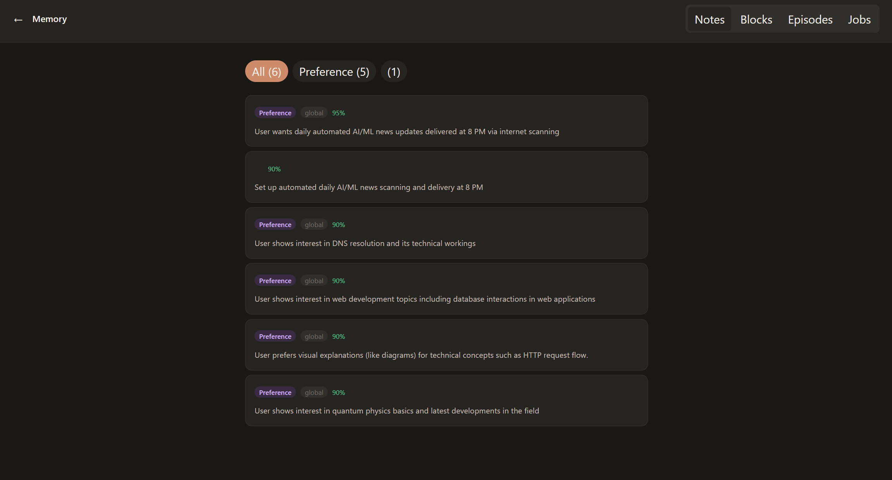

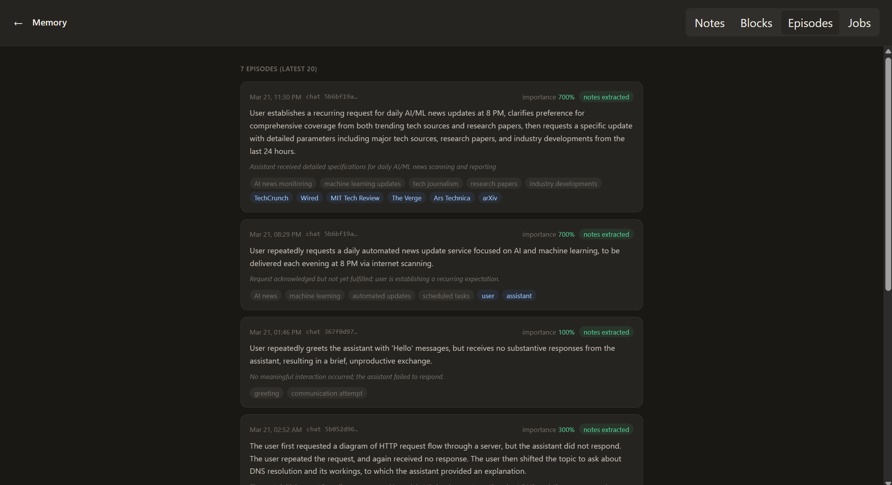

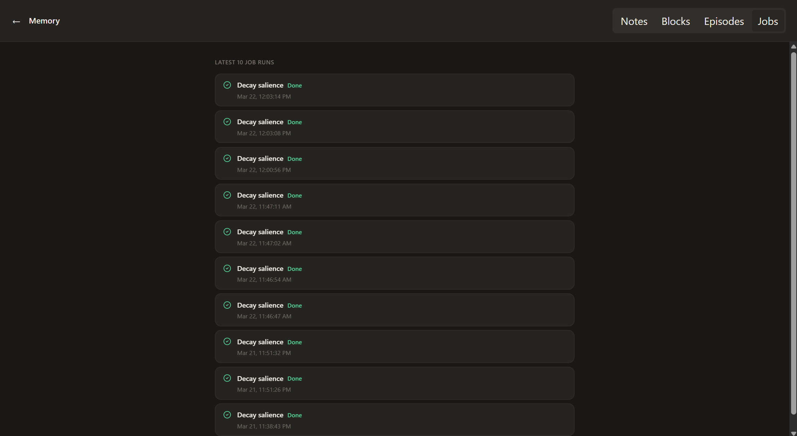

</div>

1. **Episodes** — batches of 6–20 messages are compressed by the LLM into structured episode records (summary, entities, topics, importance)
2. **Notes** — episodes are distilled into atomic, typed, fingerprinted memory notes (`preference`, `project`, `fact`, `constraint`, `task`) with `create / update / supersede / skip` actions
3. **Blocks** — active notes are collapsed into four named context blocks (`Projects`, `Preferences`, `Constraints`, `Active Tasks`) sorted by salience, injected into every system prompt (MemGPT-style)
4. **Decay** — daily salience decay (global × 0.98, chat × 0.95); chat notes below the threshold are archived

Retrieval scores notes by `semantic × 0.5 + recency × 0.25 + salience × 0.25`. Falls back gracefully to recency + salience when no embedding function is configured.

- Notes carry `confidence`, `stability`, and `salience` scores
- Chat-scoped notes with high stability and confidence auto-promote to global scope
- User-pinned and user-edited notes are never touched by automated processes
- `memory_search` skill for in-task recall during agent runs

### User Profile & Onboarding

A short guided flow captures your name, tone preference, focus areas, and response style. This profile is injected into every conversation so the assistant adapts to you from the first message.

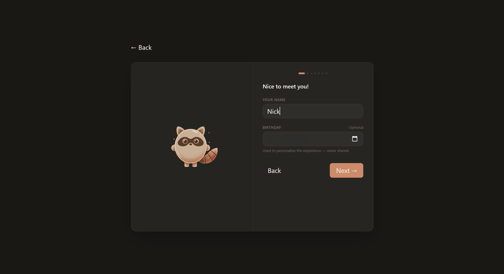

- Guided onboarding flow to capture name, tone, focus areas, response style
- Profile section injected into every system prompt
- Reset flow: wipe all data and restart onboarding from Settings

### Speech Recognition (ASR)

- Configurable ASR provider: vLLM, LocalAI (Whisper), browser dictation, Groq, Dashscope, OpenAI
- Microphone button in chat for voice input

### Settings

Add and configure providers, set default models per task type, and tune global behaviour — all stored locally.

<div style="display:grid;grid-template-columns:1fr 1fr;gap:12px">

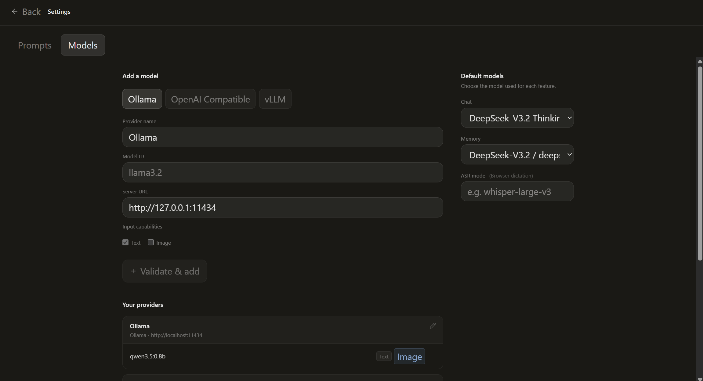

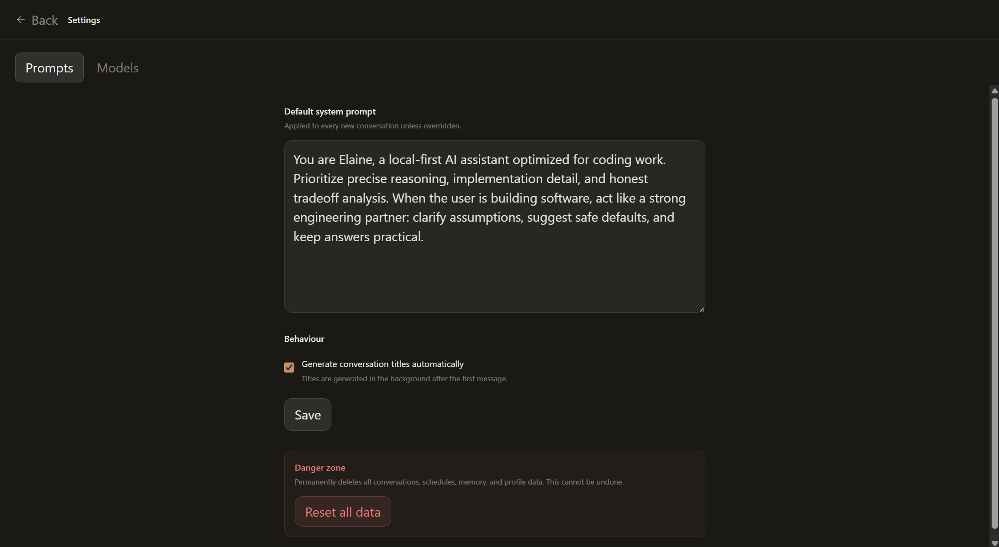

</div>

- Multi-provider profiles: Ollama, OpenAI-compatible, vLLM
- Per-model capability flags (text, vision, …)
- Default model, title model, and memory model selectors
- Custom system prompt
- Toggle automatic title generation
- **Danger zone**: full data reset with typed confirmation

---

## Stack

| Layer       | Tech                                                 |
| ----------- | ---------------------------------------------------- |
| Frontend    | React 19 · Vite · TypeScript · Tailwind CSS          |
| Backend     | Fastify · TypeScript                                 |
| Persistence | SQLite via `better-sqlite3`                          |
| Markdown    | `react-markdown` · `remark-gfm` · `rehype-highlight` |
| Runtime     | Node.js ≥ 20                                         |

---

## Quick start

```bash
npm install
npm run dev
```

- Client: http://127.0.0.1:5173
- Server: http://127.0.0.1:3001

For a production-style local run:

```bash
npm run build
npm run start
```

---

## Configuration

Copy `.env.example` to `.env` to override defaults:

```env
PORT=3001
HOST=127.0.0.1
DATABASE_PATH=./server/data/elaine.db
CLIENT_ORIGIN=http://127.0.0.1:5173
```

Provider profiles are configured inside the app and stored locally in SQLite.

---

## Tested models

Elaine has been tested and validated with:

| Model                            | Notes                                                                         |
| -------------------------------- | ----------------------------------------------------------------------------- |
| **Mistral** (7B / Small / Large) | Solid tool-call support, fast on local hardware                               |
| **Qwen 2.5 / 3** (7B–72B)        | Excellent tool use and reasoning; recommended for task and scheduled modes    |
| **DeepSeek V3**                  | Strong multi-step reasoning; works well in task mode with complex tool chains |

Any model with native **tool call / function calling support** will work. Models without tool-call support can still be used for standard chat but will not have access to the agent skill system.

---

## Default provider profiles

| Profile           | URL                        |
| ----------------- | -------------------------- |
| Ollama Local      | `http://127.0.0.1:11434`   |
| vLLM Local        | `http://127.0.0.1:8000/v1` |
| OpenAI Compatible | `http://127.0.0.1:1234/v1` |

---

## Project structure

```
assets/       Screenshots and documentation images
client/       React SPA (pages, components, hooks, API client)
server/       Fastify API
  src/
    db/         SQLite schema, migrations, repository
    providers/  OpenAI-compatible, Ollama, vLLM adapters
    routes/     REST + SSE endpoints (chat, notifications, connections, …)
    services/   Chat, title, scheduled job runner, schedule parser, OAuth manager
    skills/     Agent skill implementations
    utils/      Constants, system prompts
docs/         Architecture and design notes
```

---

## Scripts

```bash
npm run dev          # Start client + server in watch mode
npm run build        # Production build
npm run start        # Start built server (serves client too)
npm run lint         # TypeScript + ESLint checks
npm run format       # Prettier
```

---

## Roadmap

### Speech Recognition

- [ ] Complete ASR pipeline — end-to-end transcription with punctuation and language detection
- [ ] Live streaming transcription (word-by-word display while speaking)
- [ ] Speaker diarisation for multi-turn voice sessions
- [ ] Wake-word activation for hands-free use
- [ ] Per-language model routing (Whisper large for quality, small for speed)

### Visualization & UI

- [ ] Loading / generation state for widgets — skeleton and progress indicator while the agent builds a visualization
- [ ] Widget edit mode — let the user tweak chart data or layout after generation
- [ ] Animated transitions between widget states
- [ ] Export widget as image or standalone HTML
- [ ] Drag-and-drop widget reordering in multi-widget responses

### Hardware-Aware Tool Use

- [ ] Detect available hardware (GPU VRAM, CPU cores, RAM) at startup and expose as agent context
- [ ] Route tasks automatically — heavy embeddings and vision models to GPU, lightweight inference to CPU
- [ ] Adaptive concurrency — cap parallel tool calls based on available cores
- [ ] Model capability profiles tied to detected hardware (e.g. disable vision if no GPU)
- [ ] Real-time resource monitor visible in the settings panel

### Expanded Tool Library

- [ ] `image_gen` — local image generation via ComfyUI or AUTOMATIC1111
- [ ] `code_exec` — sandboxed Python / JavaScript execution with output capture
- [ ] `pdf_read` — extract and chunk PDF documents for agent use
- [ ] `db_query` — read-only SQL queries against user-specified local databases
- [ ] `calendar_read` / `calendar_write` — local calendar access (ICS files)
- [ ] `email_read` — IMAP inbox access for scheduled digest runs
- [ ] `screen_capture` — take a screenshot and pass it to a vision model
- [ ] `vector_store` — persist and search embeddings across runs

### Social Networks, Apps & MCP

- [ ] **MCP (Model Context Protocol)** — connect any MCP server as a first-class tool source; auto-discover tools and resources from running MCP processes
- [ ] Social integrations: Twitter / X, LinkedIn, Mastodon — post, search, fetch threads
- [x] Messaging channel foundation — Slack, Discord, Telegram, and WhatsApp can connect locally, receive inbound messages, and route replies back through Elaine
- [ ] Messaging channel polish — richer message types, mention-specific routing, reactions, and deeper thread awareness
- [ ] Productivity: Notion, Obsidian, Linear, GitHub Issues — create notes, manage tasks, file bugs
- [ ] Communication: email sending via SMTP, calendar invites
- [x] **OAuth flow inside the app for cloud service connections** — GitHub, Google, Discord, Slack, Twitter/X, LinkedIn, Telegram; credentials encrypted at rest
- [ ] Per-integration permission scopes — read-only by default, write requires explicit opt-in

### End-to-End Security

- [ ] **Local encryption at rest** — SQLite database encrypted with SQLCipher; key derived from a user passphrase
- [ ] **Transport security** — enforce HTTPS even for localhost; self-signed cert generator on first run
- [ ] **Secrets vault** — API keys stored encrypted, never written to plain-text config files
- [x] **Secure channel communication gate** — unknown Slack, Discord, Telegram, and WhatsApp senders do not enter a conversation automatically; approval happens per sender, and first messages stay queued until approved
- [x] **Encrypted channel credentials** — bot tokens, app tokens, and channel-linked OAuth secrets are stored encrypted locally and masked when read back through the API
- [x] **Isolated WhatsApp sessions** — each WhatsApp connection keeps its own local session state and reconnect lifecycle instead of sharing a global auth context
- [x] **Sandboxed skill execution** — `shell_exec` and `code_exec` run inside a restricted container or OS sandbox (nsjail / Docker)
- [x] **Skill permission model** — each skill requires an explicit capability grant; three-mode UI (Allow once / Allow in thread / Deny); task mode no longer auto-grants
- [x] **Audit log** — tamper-evident HMAC-signed append-only log of every tool call, argument, and result
- [ ] **Session lock** — auto-lock the app after inactivity; require passphrase or biometric to resume
- [ ] **Content filtering** — optional local classifier to flag sensitive data before it leaves the machine

---

## Changelog

### Unreleased

#### Channels

- New `/channels` flow for local messaging integrations: Telegram, WhatsApp, Discord, and Slack
- Token-based setup for Telegram, Discord, and Slack; QR-based setup for WhatsApp via a local session handshake
- Unknown channel senders are gated per sender before any inbound message is routed into an Elaine conversation
- First inbound messages are persisted as pending until approval, then replayed through the normal routing pipeline
- Channel credentials are validated before runner startup and stored encrypted locally; secrets remain masked in API reads
- WhatsApp sessions are isolated per connection and reconnect automatically after the normal post-pairing restart

#### Connections

- New `/connections` page — manage OAuth connections to external services (GitHub, Google/Gmail, Discord, Slack, Twitter/X, LinkedIn, Telegram)
- OAuth 2.0 authorization code flow with PKCE support (Twitter); bot token flow for Telegram
- Client credentials (Client ID + Secret) stored encrypted in app settings; secrets are masked when read back from the server
- OAuth popup opens in a small browser window; parent page receives a `postMessage` on success or error
- `oauth_connections` database table — stores provider, account identity, encrypted access/refresh tokens, scopes, and expiry
- **Notifications page** (`/notifications`) — persistent split-pane inbox backed by the `app_notifications` database table
- Mark individual notifications read/unread, delete by row or from the detail view, open linked conversation
- Unread badge on the sidebar profile menu Notifications entry, updated in real-time via store subscription
- Notification store bootstraps from the server on first load and syncs read/delete operations back via REST

#### Security & Permissions

- Three-mode permission UI: **Allow once** (single call, auto-revoked) / **Allow in this thread** (conversation-scoped) / **Deny**
- Task mode now requires permission grants — no capability is silently auto-granted in any agent mode
- Intent classifier model substitution: `*-reasoner` models automatically route to `*-chat` so reasoning-budget models don't fail classification silently
- Pending interactions (permission request, `ask_user`, schedule confirmation) persisted in the database — survive page refresh and device changes

#### Notifications

- Immediate browser + in-app notification when a permission request, `ask_user` widget, or schedule confirmation arrives while the page is hidden
- Notification fires on visibilitychange when the page moves to background while an interaction is waiting
- 2-minute reminder notification for unanswered interactions (only fires if page is still hidden)
- Notifications are not re-fired on page refresh or navigation — only genuinely new SSE-originated interactions trigger them

#### Visualization

- Visualizer restricted to genuinely necessary use cases — three strict conditions required before the agent may call the widget tool

#### Earlier Unreleased

- Settings "Danger zone" reset — typed confirmation wipes all data and restarts onboarding
- Scheduled run conversation titles formatted as `YYYY-MM-DD — <job title>` (never AI-generated)
- "Schedules" entry added to collapsed sidebar profile menu

### 0.4.0 — Scheduling & Autonomous Runs

- Scheduled job runner rewritten to use full task-mode agent loop (50-iteration cap, all tools)
- Each scheduled run creates a new `scheduled_run`-tagged conversation — origin chat stays clean
- `SCHEDULED_RUN_SYSTEM_PROMPT` — fully autonomous mode, always calls `task_done`
- `/schedules` page to view, pause, and edit all scheduled tasks
- Inline timing editor on the schedules page (same pill UI as the creation widget)
- Schedule recap on the new chat screen in schedule mode; click any schedule to open `/schedules`
- Schedule creation confirmation message appended to chat history after widget submission
- `schedule_setup` skill replaces XML `<schedule_plan>` hack — follows same tool-call pattern as `ask_user`
- Time-of-day picker for daily schedules; weekday + time picker for weekly schedules

### 0.3.0 — Memory System

- A-MEM / Zettelkasten / MemGPT-inspired background memory pipeline
- Four-stage async pipeline: episode building → note extraction → block rebuilding → salience decay
- Five note types: `preference`, `project`, `fact`, `constraint`, `task`
- Note fingerprinting to prevent duplicates; `create / update / supersede / skip` actions
- Chat-scoped notes auto-promote to global scope when high-stability observations span ≥ 2 chats
- Daily salience decay (global × 0.98, chat × 0.95); chat notes archived below threshold
- Retrieval scoring: `semantic × 0.5 + recency × 0.25 + salience × 0.25`
- `memory_search` skill for in-agent recall
- Memory blocks (`Projects`, `Preferences`, `Constraints`, `Active Tasks`) injected into every system prompt

### 0.2.0 — Agent Loop & Skills

- Multi-step agent loop with configurable iteration caps per mode
- Skills system: `ask_user`, `think`, `task_done`, `file_read/write/search`, `shell_exec`, `web_fetch`, `notify_user`, `send_message`, `visualize__show_widget`
- Inline widget rendering in chat (via `visualize__show_widget` skill)
- Workspace path attached to conversations for context-aware coding sessions
- Intent classifier routes messages to appropriate agent mode

### 0.1.0 — Foundation

- React 19 + Vite frontend, Fastify backend, SQLite persistence
- Provider adapters for Ollama, OpenAI-compatible APIs, and vLLM
- Streaming SSE chat with real-time markdown and code rendering
- Async background title generation
- User profile onboarding with system prompt injection
- ASR provider configuration (vLLM, LocalAI, Groq, browser dictation)
- Multi-provider profile management in settings

---

## License

MIT
